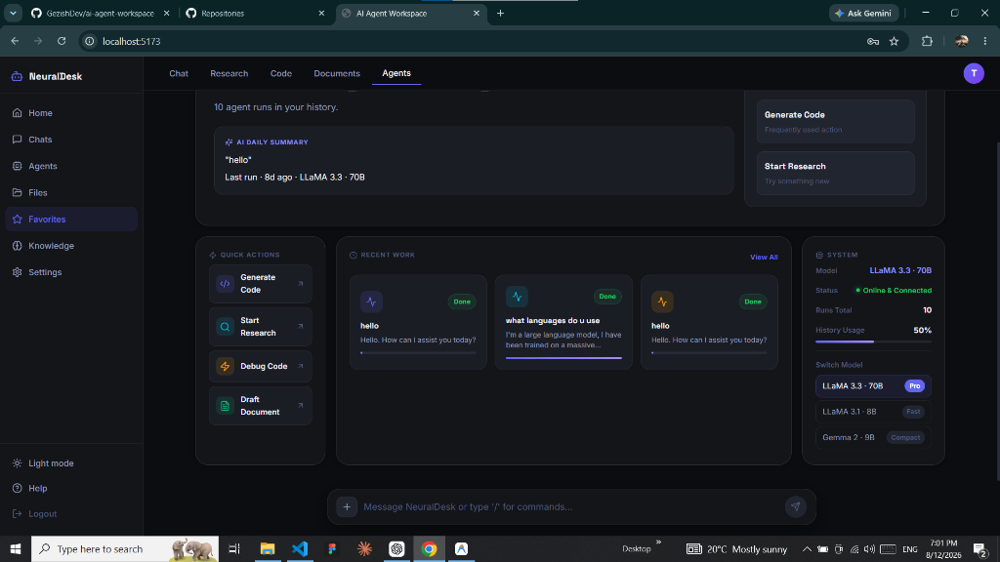
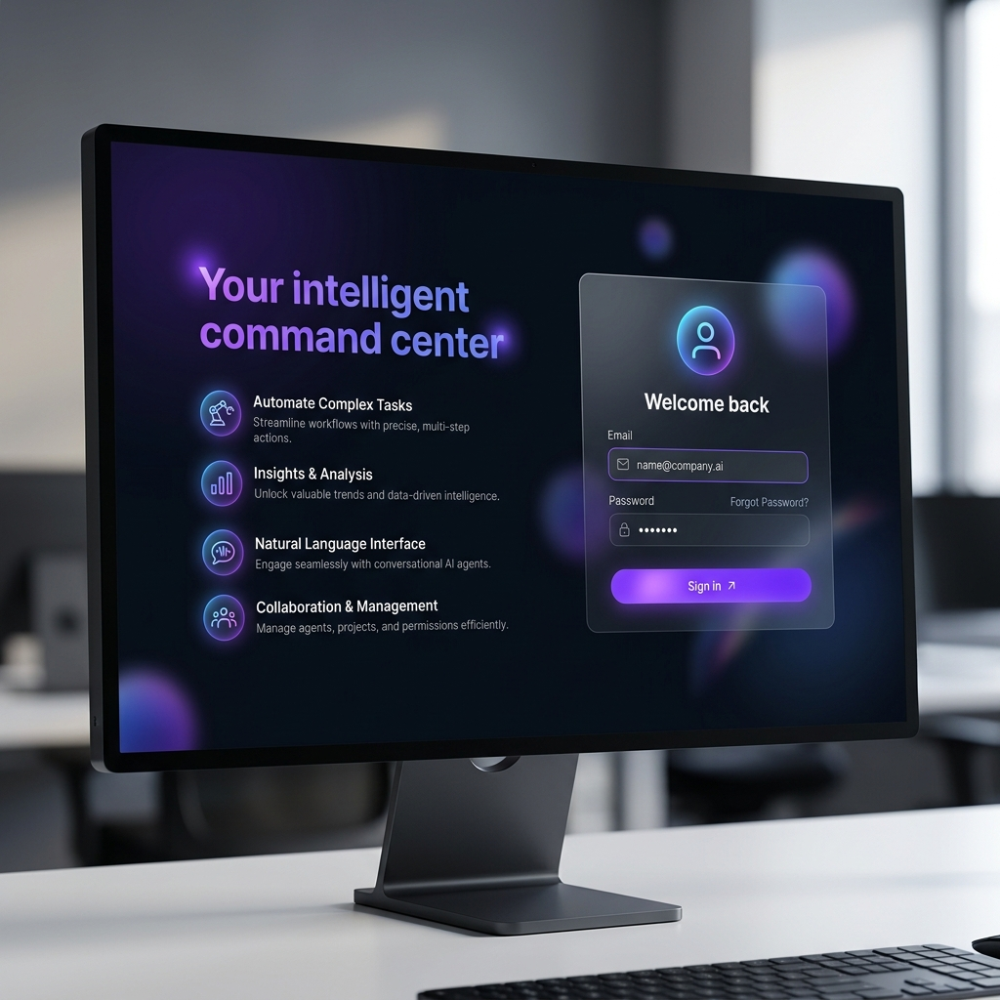
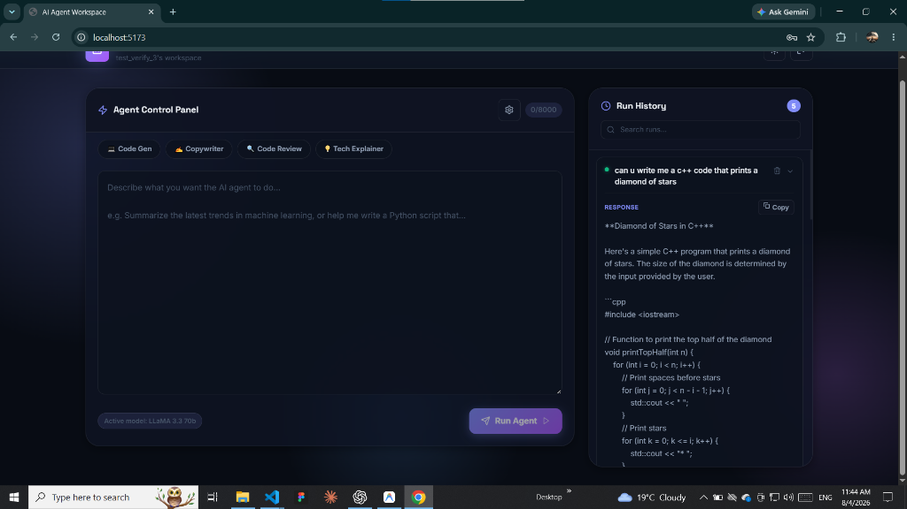
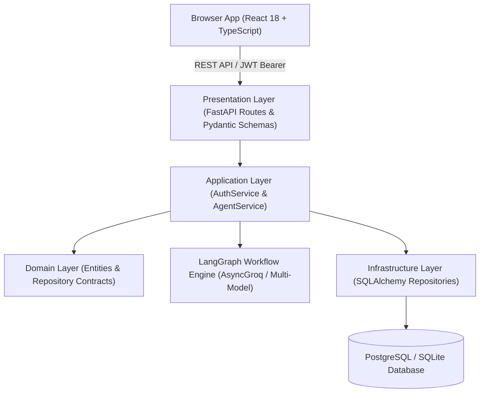

<div align="center">

# 🤖 AI Agent Workspace (NeuralDesk)

### *Production-Grade Multi-Model AI Agent Platform & Engineering Workspace*

[](https://fastapi.tiangolo.com)
[](https://reactjs.org)
[](https://www.typescriptlang.org)
[](https://www.python.org)
[](https://langchain.com)
[](https://www.docker.com)
[](#testing)

</div>

---

## 🌟 Overview

**AI Agent Workspace (NeuralDesk)** is a full-stack, enterprise-grade AI agent platform built with **FastAPI**, **LangGraph**, **React 18 (TypeScript)**, **SQLAlchemy 2 (Async)**, and **PostgreSQL**.

Designed as a portfolio project for senior backend and AI engineering roles, it demonstrates **Clean Architecture**, **Repository Pattern**, **User-Isolated JWT Authentication**, non-blocking async LLM workflows, and a modern glassmorphic dashboard UI.

---

## 🖼️ UI Screenshots & Workspace Tour

### 1. NeuralDesk Main Executive Dashboard
> Personalized AI greeting, real-time model hyperparameter status, daily AI summary, recent agent runs, and one-click quick action cards.



---

### 2. Conversational Agent Interface & Thinking Animation
> Real-time message streaming layout with model badges, token controls, copy actions, thinking indicators, and session history sidebar.



---

### 3. Agent Marketplace & Roster
> Pre-configured AI specialist agents (Code Architect, Deep Research, QA & Debugger, Technical Spec Writer) with 1-click execution presets.



---

## 🏗️ Architecture & Design Patterns

The application enforces **Strict Clean Architecture** boundaries to decouple enterprise rules from web frameworks, database ORMs, and third-party LLM APIs.



### Layer Separation Matrix

| Layer | Responsibility | Dependencies |
|---|---|---|
| 🧱 **Domain** | Pure enterprise models (`User`, `AgentRun`), repository contracts, and domain business exceptions (`AuthenticationError`, `DuplicateUserError`, `NotFoundError`). | None (Pure Python stdlib) |
| ⚙️ **Application** | Use cases (`AuthService.register`, `AuthService.login`, `AgentService.run`, `AgentService.history`). Orchestrates LangGraph state graph executions. | Domain, Core |
| 🔌 **Infrastructure** | Database connection pooling (`session.py`), SQLAlchemy models (`models.py`), Alembic migrations, and repository implementations. | Domain, Core, SQLAlchemy, AsyncGroq |
| 🌐 **Presentation** | FastAPI endpoints (`/api/v1/...`), OpenAPI schemas (Pydantic v2 validation), dependency injection, and JWT security middleware. | Application, Domain |
| 🛡️ **Core** | Configuration settings (`BaseSettings`), password hashing (`passlib`/`bcrypt`), and JWT token generation/validation (`python-jose`). | Pydantic Settings |

---

## ✨ Features & Capabilities

### 🛡️ Security & Authentication
- **Secure Password Hashing**: Passwords stored using `bcrypt` with salt; plain-text passwords never touch logs or DB.
- **JWT Authorization**: Stateless `Bearer` tokens with `HS256` signature and configurable expiration.
- **Strict User Isolation**: All query operations include `user_id` in the WHERE clause, ensuring User A can never inspect or delete User B's agent runs.
- **Uniform Auth Errors**: Login failures return non-enumerating messages to prevent account discovery attacks.

### 🤖 Multi-Model AI Workflow
- **LangGraph Integration**: Isolated `StateGraph` state engine for prompt execution and tool routing.
- **Non-Blocking Async LLM**: Powered by `AsyncGroq` client so LLM completions do not block the FastAPI event loop.
- **Model Switching**: Support for **LLaMA 3.3 70B**, **LLaMA 3.1 8B**, and **Gemma 2 9B**.
- **Dynamic Controls**: Per-request `temperature` (0.0 – 1.0) and `max_tokens` (256 – 8192) adjustments.

### 📊 Comprehensive Workspace Navigation
- **Home Dashboard**: Quick actions, recent run metrics, active model status, and history usage meter.
- **Conversational Workspace**: Threaded chat history, agent responses, copy snippet chips, and custom settings tray.
- **Agent Marketplace**: Specialized agents for Coding, Research, QA/Debugging, and Spec Documentation.
- **Workspace Files**: Searchable repository of generated outputs and exported code snippets.
- **Favorites & Starred Runs**: Bookmark high-value responses with local storage persistence.
- **Knowledge & RAG**: Context document manager and vector embedding status tracking.
- **Settings & Security**: Real-time hyperparameter default configurations and session details.

---

## 🛠️ Tech Stack

- **Backend Framework**: [FastAPI](https://fastapi.tiangolo.com/) (Python 3.12)
- **AI / Agent Engine**: [LangGraph](https://langchain-ai.github.io/langgraph/) & [AsyncGroq](https://github.com/groq/groq-python)
- **Database & ORM**: PostgreSQL 16 / SQLite with [SQLAlchemy 2 (Async)](https://www.sqlalchemy.org/) & [Alembic](https://alembic.sqlalchemy.org/)
- **Frontend Framework**: [React 18](https://reactjs.org/) + [TypeScript](https://www.typescriptlang.org/) + [Vite](https://vitejs.dev/)
- **Styling & Icons**: Custom Dark Glassmorphism CSS + [Lucide Icons](https://lucide.dev/)
- **Testing**: [pytest](https://docs.pytest.org/) (AsyncIO + HTTPX ASGI) & [Vitest](https://vitest.dev/)
- **Containerization**: [Docker](https://www.docker.com/) & Docker Compose (Multi-stage builds & health checks)

---

## 🚀 Quick Start Guide

### Option 1: Quickstart with Docker Compose (Recommended)

1. Clone the repository and navigate into the folder:
   ```bash
   git clone https://github.com/GezishDev/ai-agent-workspace.git
   cd ai-agent-workspace
   ```

2. Copy the environment file template:
   ```bash
   cp .env.example .env
   ```

3. Open `.env` and set your `GROQ_API_KEY` and a strong `JWT_SECRET_KEY`.

4. Build and start all services:
   ```bash
   docker compose up --build
   ```

5. Open your browser:
   - **Frontend Workspace**: `http://localhost:5173`
   - **FastAPI API Documentation**: `http://localhost:8000/docs`

---

### Option 2: Local Development Setup (Without Docker)

#### 1. Backend Setup

```bash
cd backend

# Create and activate virtual environment
python -m venv .venv
source .venv/bin/activate  # On Windows: .venv\Scripts\activate

# Install package in editable mode with development dependencies
pip install -e ".[dev]"

# Create local environment configuration
cp ../.env.example .env

# Run FastAPI backend server (uses SQLite locally by default)
python -m uvicorn app.main:app --host 0.0.0.0 --port 8000 --reload
```

#### 2. Frontend Setup

```bash
cd frontend

# Install node dependencies
npm install

# Start Vite development server
npm run dev
```

---

## 🧪 Testing & Validation

The project includes an automated test suite covering unit rules, integration flows, auth boundary conditions, and UI rendering.

### Run Backend Tests (28 Tests)

```bash
cd backend
pytest -v
```

**Test Coverage Highlights:**
- `test_auth_api.py`: Account creation, case normalization, password length limits, credential validation, non-leaking errors, unauthorized token rejection.
- `test_agent_api.py`: Prompt execution, model parameters passing, run history pagination, **strict user isolation verification (preventing cross-user reads/deletions)**.
- `test_auth_service.py`: Domain service logic unit tests.

### Run Frontend Tests (5 Tests) & Build Verification

```bash
cd frontend

# Run Vitest test suite
npm test

# Verify production bundle build
npm run build
```

---

## 🔌 API Endpoint Reference

| Method | Endpoint | Auth Required | Description |
|---|---|---|---|
| `GET` | `/api/v1/health` | No | System health and liveness probe |
| `POST` | `/api/v1/auth/register` | No | Create user account & issue JWT token |
| `POST` | `/api/v1/auth/login` | No | Authenticate credentials & issue JWT token |
| `POST` | `/api/v1/agents/runs` | Yes (Bearer) | Execute agent prompt & persist run |
| `GET` | `/api/v1/agents/runs` | Yes (Bearer) | Fetch paginated run history for current user |
| `GET` | `/api/v1/agents/runs/{id}` | Yes (Bearer) | Retrieve specific agent run detail |
| `DELETE` | `/api/v1/agents/runs/{id}` | Yes (Bearer) | Delete specific run owned by current user |

---

## 🔒 Security Best Practices Implemented

- ✅ **No Hardcoded Secrets**: Secrets loaded via `pydantic-settings` from `.env` (ignored in `.gitignore`).
- ✅ **Clean Error Responses**: Unexpected exceptions sanitized; sensitive database details never exposed to clients.
- ✅ **CORS Restricted**: Allowed origins explicitly defined without permissive wildcards when credentials are enabled.
- ✅ **Parameter Validation**: Pydantic validation on prompt length, model names, temperature ranges, and max tokens.

---

## 🔮 Future Enhancements

The codebase is structured to easily integrate the following advanced capabilities:
- **Server-Sent Events (SSE)** for real-time token-by-token streaming.
- **RAG Integration** with PgVector / ChromaDB.
- **Tool Node Expansion** in LangGraph (Web Browsing, Code Sandbox Execution).
- **Refresh Token Rotation** and session revoking.

---

<div align="center">

Crafted with care by **GezishDev** • Powered by FastAPI & React

</div>
